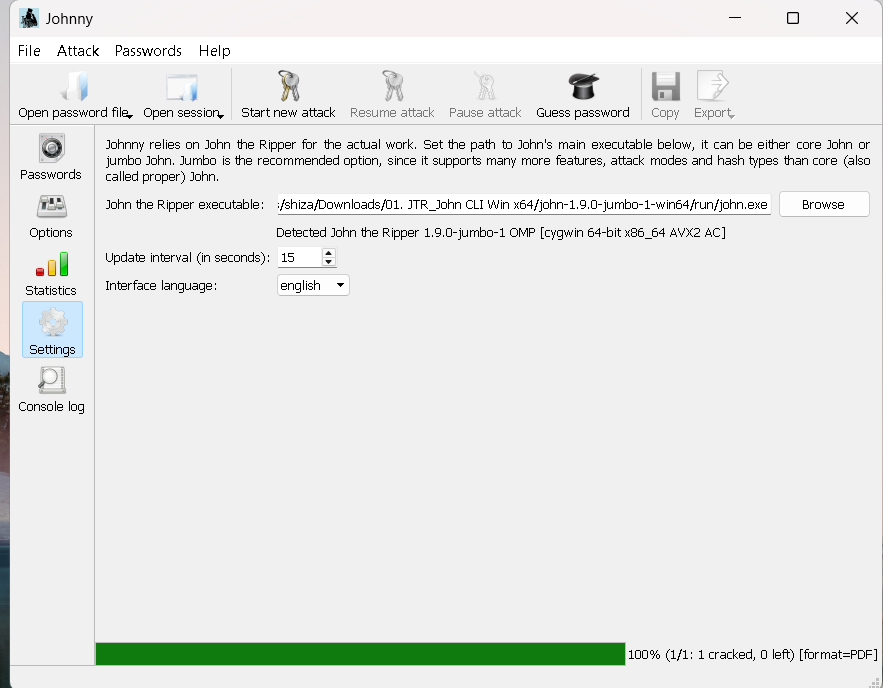
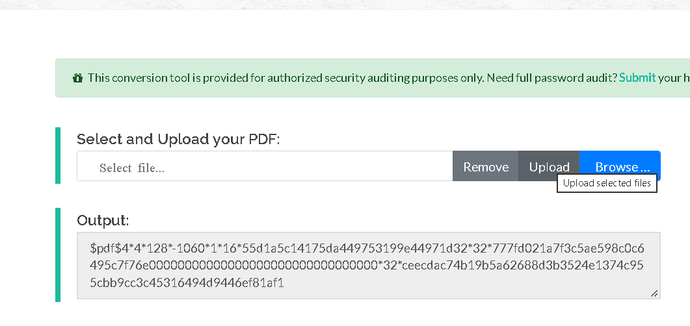
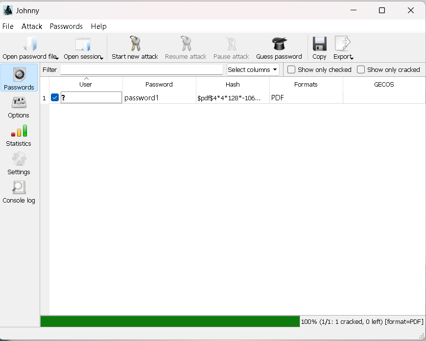

# 🔐 Cracking a Password-Protected PDF using John the Ripper (JTR) & Johnny (Windows)

A step-by-step, authorized security-lab walkthrough for recovering the password of a locked PDF (`My Locked PDF1.pdf`) using **John the Ripper (JTR)** together with the **Johnny** GUI on Windows.

> ⚠️ **Disclaimer:** This guide is for **educational purposes and authorized security auditing only** — e.g. recovering a password you forgot, or practicing on files you own or are permitted to test. Do not use these tools to access files or systems without permission.

> 💡 **Note:** If you're on **Kali Linux**, John the Ripper comes **pre-installed**, so you can skip straight to Step 3.

---

## 📑 Table of Contents

- [Tools Used](#-tools-used)
- [Step 1 — Download John the Ripper](#step-1--download-john-the-ripper)
- [Step 2 — Download & Configure Johnny GUI](#step-2--download--configure-johnny-gui)
- [Step 3 — Extract the PDF Hash & Crack the Password](#step-3--extract-the-pdf-hash--crack-the-password)
- [Result](#-result)
- [Tags](#-tags)

---

## 🛠 Tools Used

| Tool | Purpose |
|---|---|
| [John the Ripper (JTR)](https://www.openwall.com/john/) | Password cracking engine |
| [Johnny](https://openwall.info/wiki/john/johnny) | GUI front-end for John the Ripper |
| [Online PDF Hash Extractor](https://www.onlinehashcrack.com/tools-pdf-hash-extractor.php) | Extracts the crackable hash from a protected PDF |

---

## Step 1 — Download John the Ripper

Download John the Ripper (JTR) for Windows from any of the following sources:

- Official site: https://www.openwall.com/john/
- Mirror: https://distro.ibiblio.org/openwall/projects/john/1.9.0/
- Google Drive mirror: [Download link](https://drive.google.com/drive/u/1/folders/1aHtgOh7U9mQhkN8VHU7ctTyaDg5KbuJx)

Use the **jumbo** build (e.g. `JTR_CLI_Win x64/john-1.9.0-jumbo-1-win64`) rather than core John — jumbo supports far more attack modes and hash/file formats, including PDFs.

---

## Step 2 — Download & Configure Johnny GUI

1. Download Johnny from the official wiki or the Google Drive mirror above:
   - Official: https://openwall.info/wiki/john/johnny
   - Google Drive mirror: [Download link](https://drive.google.com/drive/u/1/folders/1aHtgOh7U9mQhkN8VHU7ctTyaDg5KbuJx)
2. Run the Johnny installer and complete the setup.
3. Open **Johnny** and go to the **Settings** tab.
4. Click **Browse** next to "John the Ripper executable" and point it to your `john.exe`, found inside the `run` folder of your extracted JTR download (e.g. `...\JTR_CLI_Win x64\john-1.9.0-jumbo-1-win64\run\john.exe`).

Once selected, Johnny will confirm the detected version, e.g. `John the Ripper 1.9.0-jumbo-1 OMP [cygwin 64-bit x86_64 AVX2 AC]`.

---

## Step 3 — Extract the PDF Hash & Crack the Password

1. Locate the encrypted PDF file (`My Locked PDF1.pdf`) on your PC.
2. Open the online PDF hash extractor tool:
   👉 https://www.onlinehashcrack.com/tools-pdf-hash-extractor.php
3. Click **Browse**, select your PDF, then click **Upload**.

4. Copy the generated hash value (it should start with `$pdf$...`).
   > ⚠️ If the copied hash has stray characters like a leading `b'` or trailing `'`, remove them — the hash must start cleanly with `$pdf$`.
5. Open **Notepad**, paste the hash, and save the file as **`hash1.txt`**.
6. Open **Johnny** and click **Open password file**.
7. Browse to `hash1.txt` and open it — the hash will load into Johnny's password table.
8. Click **Start new attack** to begin cracking.

Johnny will run John the Ripper in the background and update progress at the interval configured in Settings. When finished, the cracked password appears directly in the **Password** column.

9. Open the original encrypted PDF and enter the cracked password (e.g. `password1`) when prompted.
10. 🎉 The PDF opens successfully!

---

## ✅ Result

The password for `My Locked PDF1.pdf` was successfully recovered using **John the Ripper + Johnny**, confirming the file can now be opened without restriction.

---

## 🏷 Tags

`#JohnTheRipper` `#JTR` `#Johnny` `#PasswordCracking` `#PDFSecurity` `#EthicalHacking` `#CyberSecurity` `#CTF` `#SecurityAuditing` `#InfoSec` `#Windows` `#NetworkwalksAcademy`

---

*Made for educational / authorized security-auditing purposes only.*
